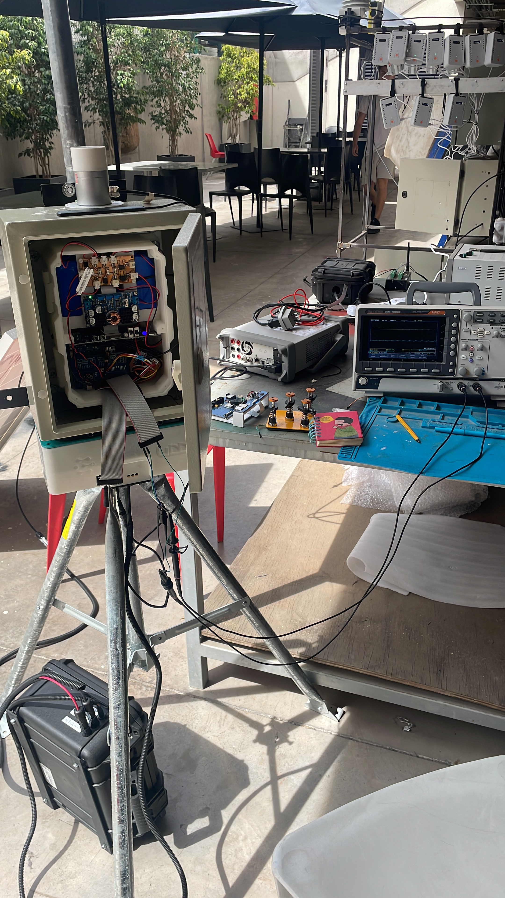
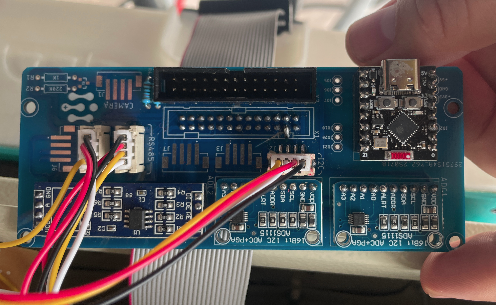
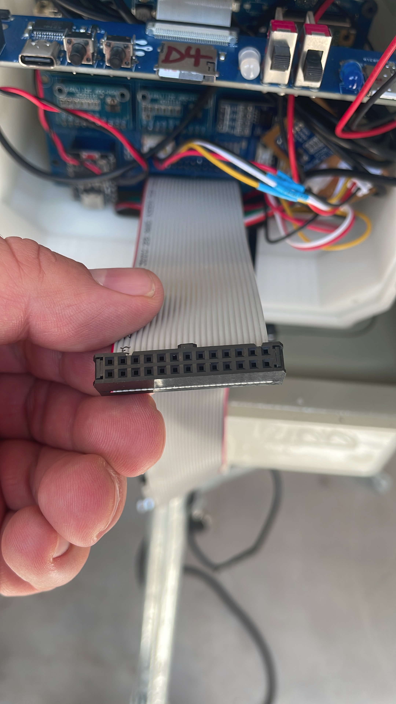
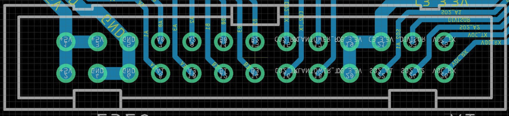
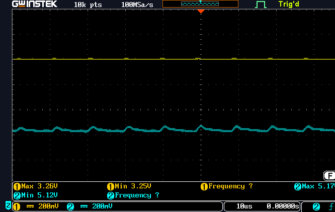

# Informe de análisis de la fuente – Estación 1

Este repositorio recopila los antecedentes del ensayo ejecutado el 17 de noviembre de 2025 en el Laboratorio de Electrónica C+ (UDD). El objetivo fue evaluar el desempeño de la fuente que alimenta, mediante el cable IDC paralelo, a los sensores electroquímicos AlphaSense instalados en la placa denominada *hijo* de la estación de calidad del aire.

## Contexto visual

**Figura 1. Vista general del montaje de prueba con el cable paralelo conectado a la placa hijo.**



## Metodología

1. **Verificación con voltímetro.** Con el multímetro Keysight 34461A se identificaron y revisaron los pines Vout (5 V y 3.3 V) y GND en el conector IDC para asegurar continuidad y polaridad antes de instrumentar la prueba.

   **Figura 2. Placa hijo (izquierda) y vista del conector IDC hembra donde se hicieron las mediciones.**

   
   

2. **Caracterización con osciloscopio.** Se utilizó un osciloscopio GW Instek serie GDS (firmware V1.29) con puntas 1× para capturar dos ventanas de 10.000 muestras por canal directamente en el conector IDC, manteniendo como referencia el GND común de la estación (ver Figuras 3 y 4). Las mediciones dinámicas se realizaron con la estación alimentada por su banco de baterías y únicamente con la carga propia de los sensores, sin elementos adicionales.

3. **Procesamiento de datos.** Los archivos CSV exportados (`datos/DS0003.CSV` para 3.3 V y `datos/DS0004.CSV` para 5 V) se procesaron con Python para calcular mínimos, máximos, promedio (ave), desviación estándar (sdt), ruido RMS (igual a sdt) y la relación señal-ruido `S/R = ave / sdt`.

   ```python
   import csv, pathlib
   for name in ("DS0003.CSV", "DS0004.CSV"):
       path = pathlib.Path("datos") / name
       with path.open() as fh:
           for line in fh:
               if line.strip().startswith("Waveform Data"):
                   break
           valores = [float(v) for _, v, *_ in (row.split(',') for row in fh if row.strip()) if v]
       n = len(valores)
       ave = sum(valores)/n
       sdt = (sum((x-ave)**2 for x in valores)/n)**0.5
       print(name, min(valores), max(valores), ave, sdt, ave/sdt)
   ```

## Recursos disponibles

- **Datos crudos:** `datos/DS0003.CSV` y `datos/DS0004.CSV` contienen la metadata del instrumento y las 10.000 muestras de cada línea.
- **Diagramas y fotografías:**
  - **Figura 3. Distribución de conectores del cable paralelo que llega a los sensores.**
    
    
  - **Figura 4. Captura del GW Instek GDS durante la caracterización de rizado en las líneas de 3.3 V y 5 V.**
    
    
- **Informe en LaTeX:** `informe/informe_analisis_fuente.tex` recoge la versión formal del reporte utilizada en el proyecto, con portada, figuras, tcolorbox y recomendaciones detalladas para implementación y futuras mediciones.

## Resultados

| Línea medida | Archivo | Min (V) | Max (V) | Ave (V) | sdt (V) | Ruido RMS (mV) | S/R (ave/sdt) |
|--------------|---------|--------:|--------:|--------:|--------:|---------------:|--------------:|
| Vout 3.3 V   | `datos/DS0003.CSV` | 3.250 | 3.260 | 3.259998 | 0.000141 | 0.141 | 23,054 |
| Vout 5 V     | `datos/DS0004.CSV` | 5.120 | 5.180 | 5.142737 | 0.010890 | 10.890 | 472.23 |

**Observaciones:**
- La línea de 3.3 V mantiene un ruido RMS de solo 0.141 mV y una relación S/R superior a 23.000, ideal para la electrónica digital de los sensores.
- La línea de 5 V presenta un rizado de 60 mV pico a pico y 10.9 mV RMS, dentro de las tolerancias del acondicionamiento analógico AlphaSense.
- No se observaron pulsos o caídas atribuibles a falsos contactos; las variaciones corresponden al ripple natural del sistema de alimentación de la Estación 1.

## Conclusiones

- El cable paralelo asociado a la placa hijo cumple con las especificaciones de tensión y ruido establecidas por AlphaSense; no se registraron interferencias durante el ensayo.
- El ruido medido (<11 mV RMS) es insuficiente para afectar la linealidad de los acondicionadores o los ADC.
- No se detectaron problemas de continuidad ni polaridad, de modo que el conjunto puede mantenerse en servicio sin ajustes.

## Recomendaciones

- Reducir la distancia entre ADC y sensores, blindar los cables y asegurar un buen contacto a tierra.
- Verificar la existencia de planos de tierra y añadir filtros pasa bajo con capacitores de 10 nF y 100 nF cerca del conector Molex ISB.
- Repetir la captura tras cualquier intervención, incorporar mediciones con carga efectiva (sensores conectados) y, de ser posible, complementar con análisis espectral del ruido.

Se recomienda conservar esta carpeta junto al informe en LaTeX para futuras auditorías del subsistema de alimentación.
